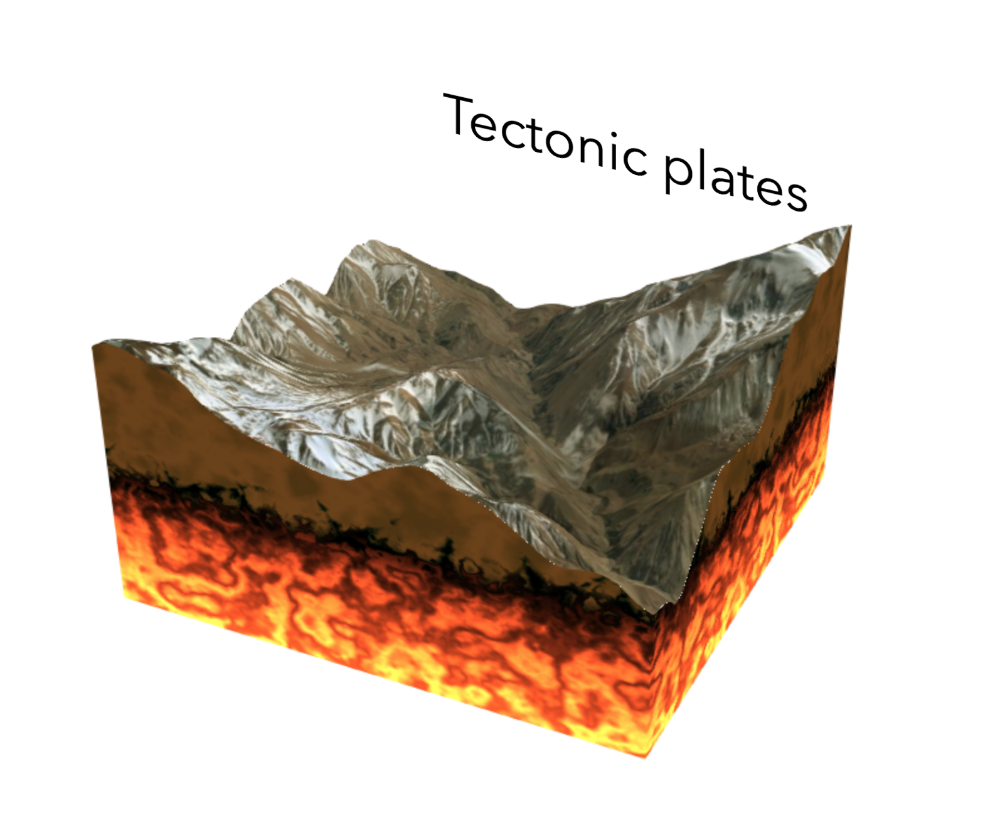

# Presentations

## Getting started with 3D in the ArcGIS API for JavaScript

Discover the 3D capabilities of the ArcGIS API 4.x for JavaScript. Learn how you can leverage the WebGL capabilities of your browser with the JavaScript API to build stunning 3D web applications. This session will focus on the fundamental 3D building blocks of the API: SceneView, 2D and 3D layers, terrain, and symbology.

Live: https://jkieboom.github.io/devsummit-2018-palm-springs/presentations/getting-started-3d-arcgis-js-api

## Using TypeScript with the ArcGIS API for JavaScript

In this session we will learn some of the basics of TypeScript and how it can help you as a developer using the ArcGIS API for JavaScript. We will also look at how to set up a development environment and use the provided TypeScript definition files.

Live: https://jkieboom.github.io/devsummit-2018-palm-springs/presentations/typescript-arcgis-js-api

# Demos

## Tectonic plates visualization

Live: https://jkieboom.github.io/devsummit-2018-palm-springs/demos/tectonic
