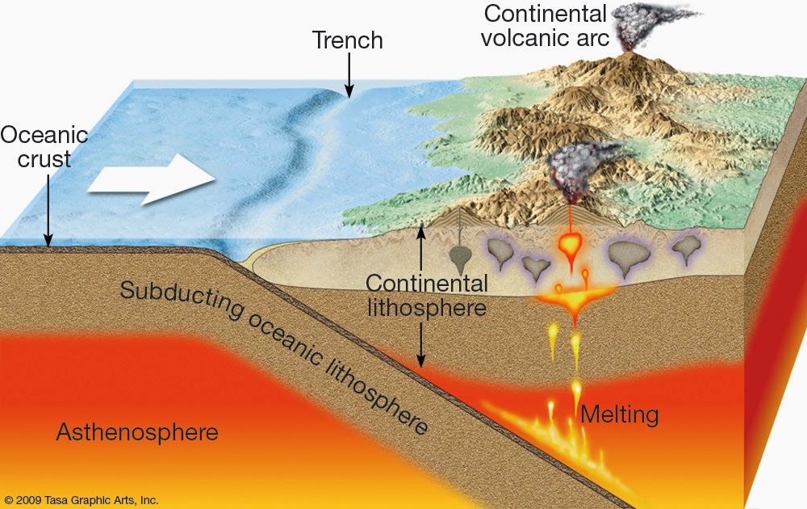

<!-- .slide: data-background="images/bg-1.png" -->

## Advanced 3D Features 

<br/>

### ArcGIS API for JavaScript

<br/>

<p>Jesse van den Kieboom, ESRI R&amp;D Center Z&uuml;rich</p>
<p>Thomas Other, ESRI R&amp;D Center Z&uuml;rich</p>

---

<!-- .slide: data-background="images/bg-4.png" -->

## Agenda

1. Introduction to 3D
  - 4.x Foundations
  - Working with the 3D SceneView
  - Adding custom graphics
1. Customized 3D Visualizations
  - Custom Mesh
  - External Renderer
  - Camera fly-by


---

<!-- .slide: data-background="images/bg-4.png" -->

## ArcGIS API for JavaScript
### _4.x Foundations_

---


<!-- .slide: data-background="images/bg-6.png" -->

### JavaScript API
#### _Basic Concepts_

- Unified 2D and 3D [`Map`](https://developers.arcgis.com/javascript/latest/api-reference/esri-Map.html) data model:
  - [`Layer`](https://developers.arcgis.com/javascript/latest/api-reference/esri-layers-Layer.html) &mdash; Fundamental Map component
  - [`Renderer`](https://developers.arcgis.com/javascript/latest/api-reference/esri-renderers-Renderer.html) &mdash; Visualization Methods
  - [`Symbol`](https://developers.arcgis.com/javascript/latest/api-reference/esri-symbols-Symbol.html) &mdash; Symbolization Instructions
- Common [`View`](https://developers.arcgis.com/javascript/latest/api-reference/esri-views-View.html) subclass between 2D and 3D:
  - [`MapView`](https://developers.arcgis.com/javascript/latest/api-reference/esri-views-MapView.html) &mdash; 2D Visualization
  - [`SceneView`](https://developers.arcgis.com/javascript/latest/api-reference/esri-views-SceneView.html) &mdash; 3D Visualization
- Makes it easy to transition between 2D and 3D
- To use 3D effectively one needs to understand 3D concepts

---


<!-- .slide: data-background="images/bg-6.png" -->

### JavaScript API
#### _2D &amp; 3D Viewing_

<div class="twos">
  <div class="snippet">
  <pre><code class="lang-js hljs javascript">
var map = new Map({
  basemap: "streets",

  layers: [new FeatureLayer(
    "...Germany/FeatureServer/0"
  )]
});

viewLeft = new MapView({
  container: "viewDivLeft",

  map: map
});

viewRight = new SceneView({
  container: "viewDivRight",

  map: map
});

</code></pre>
  </div>
  <div class="snippet-preview">
    <iframe id="frame-2d-3d-parallel" data-src="./snippets/setup-2d-3d-parallel.html"></iframe>
  </div>
</div>


---


<!-- .slide: data-background="images/bg-6.png" -->

### JavaScript API
#### _Promises_

- All asynchronous operations are modeled as a `Promise`
- Certain classes _are_ promises themselves ([`SceneView`](https://developers.arcgis.com/javascript/latest/api-reference/esri-views-SceneView.html), [`MapView`](https://developers.arcgis.com/javascript/latest/api-reference/esri-views-MapView.html), [`Layer`](https://developers.arcgis.com/javascript/latest/api-reference/esri-layers-Layer.html))
- `Promises` are chainable and allow writing sequential asynchronous code

```js
view
    .when(() => {
      // View is ready to be interacted with, load the layer
      return layer.load();
    })

    .then(() => {
      // Layer is now loaded, project extent using geometry service
      return geometryService.project([layer.fullExtent]);
    })

    .then((projected) => {
      // Extent has been projected, we can now go to it
      return view.goTo(projected[0]);
    })

    .then(() => {
      // Here the gotTo animation has finished
    });
```

---


<!-- .slide: data-background="images/bg-4.png" -->

## ArcGIS API for JavaScript
### _Working with the 3D SceneView_

---


<!-- .slide: data-background="images/bg-6.png" -->

### SceneView
#### _The 3D View_

- The [`SceneView`](https://developers.arcgis.com/javascript/latest/api-reference/esri-views-SceneView.html) provides 3D specific functionality


```ts
class SceneView {
  // Camera specifies the view
  camera: Camera;

  // Programmatic navigation
  goTo(...);

  // Settings that affect constraints (e.g. navigation constraints)
  constraints: SceneViewConstraints;

  // Padding on the view
  padding: { top: number, right: number, bottom: number, left: number };

  // Quality profile
  qualityProfile: string;

  // Converting coordinate systems
  toScreen(mapPoint: Point): ScreenPoint;
  toMap(screenPoint: ScreenPoint): Point;
}
```

---


<!-- .slide: data-background="images/bg-6.png" -->


### SceneView
#### _Camera Definition_

- 3D viewing parameters in a [`SceneView`](https://developers.arcgis.com/javascript/latest/api-reference/esri-views-SceneView.html) are controlled by [`esri/Camera`](https://developers.arcgis.com/javascript/latest/api-reference/esri-Camera.html)

```ts
class Camera {
  // The position of the camera eye in 3D space (`x`, `y` + `z` elevation)
  position: Point;

  // The heading angle (towards north in degrees, [0, 360]°)
  heading: number;

  // The tilt angle ([0, 180]°, with 0° straight down, 90° horizontal)
  tilt: number;
}
```

---


<!-- .slide: data-background="images/bg-6.png" -->

### SceneView
#### _Camera Interaction_

- Changing [`SceneView.camera`](https://developers.arcgis.com/javascript/latest/api-reference/esri-views-SceneView.html#camera) immediately updates the 3D view

<div class="twos">
  <div class="snippet">
  <pre><code class="lang-js hljs javascript">// Get a copy of the current camera
var camera = view.camera.clone();

// Increment the heading of the camera by 5 degrees
camera.heading += 5;

// Set the modified camera on the view
view.camera = camera;</code></pre>
  <svg data-play-frame="frame-camera-heading-increment" class="play-code" viewBox="0 0 24 24"><path fill="#999" d="M12,20.14C7.59,20.14 4,16.55 4,12.14C4,7.73 7.59,4.14 12,4.14C16.41,4.14 20,7.73 20,12.14C20,16.55 16.41,20.14 12,20.14M12,2.14A10,10 0 0,0 2,12.14A10,10 0 0,0 12,22.14A10,10 0 0,0 22,12.14C22,6.61 17.5,2.14 12,2.14M10,16.64L16,12.14L10,7.64V16.64Z" /></svg>
  </div>
  <div class="snippet-preview">
    <iframe id="frame-camera-heading-increment" data-src="./snippets/setup-camera-heading-increment.html"></iframe>
  </div>
</div>

---


<!-- .slide: data-background="images/bg-6.png" -->

### SceneView
#### _View Navigation_

- Use [`SceneView.goTo(target[, options])`](https://developers.arcgis.com/javascript/latest/api-reference/esri-views-SceneView.html#goTo) to navigate
 - Supports different targets: `Camera`, `Geometry`, `Geometry[]`, `Graphic`, `Graphic[]`
 - Supports specifying desired `scale`, `position`, `heading` and `tilt`
 - Allows specifying animation options: `animate`, `speedFactor` or `duration`, `easing`
 - Returns a `Promise` which resolves when the animation has finished

---


<!-- .slide: data-background="images/bg-6.png" -->

### SceneView
#### _View Navigation &num;1_

- Use [`SceneView.goTo()`](https://developers.arcgis.com/javascript/latest/api-reference/esri-views-SceneView.html#goTo) to view a set of graphics at a certain scale, heading and tilt

<div class="twos">
  <div class="snippet">
  <pre><code class="lang-js hljs javascript">// Specify a target and additional
// parameters to further control the view
view.goTo({

  // The target is a set of graphics which should be
  // brought into view
  target: view.graphics

  // Additionally, define at which scale, heading and tilt
  // these graphics should be viewed
  scale: 5000,
  heading: 30,
  tilt: 60
});
</code></pre>
  <svg data-play-frame="frame-goto-graphics" class="play-code" viewBox="0 0 24 24"><path fill="#999" d="M12,20.14C7.59,20.14 4,16.55 4,12.14C4,7.73 7.59,4.14 12,4.14C16.41,4.14 20,7.73 20,12.14C20,16.55 16.41,20.14 12,20.14M12,2.14A10,10 0 0,0 2,12.14A10,10 0 0,0 12,22.14A10,10 0 0,0 22,12.14C22,6.61 17.5,2.14 12,2.14M10,16.64L16,12.14L10,7.64V16.64Z" /></svg>
  </div>
  <div class="snippet-preview">
    <iframe id="frame-goto-graphics" data-src="./snippets/setup-goto-graphics.html"></iframe>
  </div>
</div>

---


<!-- .slide: data-background="images/bg-6.png" -->

### SceneView
#### _View Navigation &num;2_

- Use [`SceneView.goTo()`](https://developers.arcgis.com/javascript/latest/api-reference/esri-views-SceneView.html#goTo) to create a smooth camera animation on the 3D view

<div class="twos">
  <div class="snippet">
  <pre><code class="lang-js hljs javascript">var h = view.camera.heading;

// Set the heading of the view to
// the closest multiple of 30 degrees
var heading = Math.floor(h / 30) * 30 + 30;

// go to heading preserves view.center
view.goTo({
  heading: heading
});
</code></pre>
  <svg data-play-frame="frame-goto-heading" class="play-code" viewBox="0 0 24 24"><path fill="#999" d="M12,20.14C7.59,20.14 4,16.55 4,12.14C4,7.73 7.59,4.14 12,4.14C16.41,4.14 20,7.73 20,12.14C20,16.55 16.41,20.14 12,20.14M12,2.14A10,10 0 0,0 2,12.14A10,10 0 0,0 12,22.14A10,10 0 0,0 22,12.14C22,6.61 17.5,2.14 12,2.14M10,16.64L16,12.14L10,7.64V16.64Z" /></svg>
  </div>
  <div class="snippet-preview">
    <iframe id="frame-goto-heading" data-src="./snippets/setup-goto-heading.html"></iframe>
  </div>
</div>

---


<!-- .slide: data-background="images/bg-6.png" -->

### SceneView
#### _View Navigation &num;3_

- Use [`SceneView.goTo()`](https://developers.arcgis.com/javascript/latest/api-reference/esri-views-SceneView.html#goTo) `options` to control the animation

<div class="twos">
  <div class="snippet">
  <pre><code class="lang-js hljs javascript">function rotateView(easing) {
  var cam = view.camera.clone();
  cam.position = {
      longitude: cam.position.longitude + 90,
      ...
  };

  return view.goTo({
    target: cam
  }, {
    easing: easing,
    ...
  });
}

rotateView("linear")

.then(function() {
  return rotateView("in-out-cubic");
})

.then(function() {
  rotateView("in-out-expo");
});
</code></pre>
  <svg data-play-frame="frame-goto-options" class="play-code" viewBox="0 0 24 24"><path fill="#999" d="M12,20.14C7.59,20.14 4,16.55 4,12.14C4,7.73 7.59,4.14 12,4.14C16.41,4.14 20,7.73 20,12.14C20,16.55 16.41,20.14 12,20.14M12,2.14A10,10 0 0,0 2,12.14A10,10 0 0,0 12,22.14A10,10 0 0,0 22,12.14C22,6.61 17.5,2.14 12,2.14M10,16.64L16,12.14L10,7.64V16.64Z" /></svg>
  </div>
  <div class="snippet-preview">
    <iframe id="frame-goto-options" data-src="./snippets/setup-goto-options.html"></iframe>
  </div>
</div>

---


<!-- .slide: data-background="images/bg-6.png" -->

### SceneView
#### _View Constraints_

- Use [`SceneView.constraints`](https://developers.arcgis.com/javascript/latest/api-reference/esri-views-SceneView.html#constraints) to control navigation and rendering aspects

<div class="twos">
  <div class="snippet">
  <pre><code class="lang-js hljs javascript">// The minimum and maximum allowed
// altitude (camera.position.z) of the camera.
view.constraints.altitude = {
  min: 10000000, // 10'000 km
  max: 30000000 // 30'000 km
};

// Set the clip distance near/far values
// to override the default clipping heuristics
view.constraints.clipDistance = {
  near: 10000000, // 10'000 km
  far: 40000000 // 40'000 km
};

</code></pre>
  <svg data-play-frame="frame-constraints-altitude" class="play-code" viewBox="0 0 24 24"><path fill="#999" d="M12,20.14C7.59,20.14 4,16.55 4,12.14C4,7.73 7.59,4.14 12,4.14C16.41,4.14 20,7.73 20,12.14C20,16.55 16.41,20.14 12,20.14M12,2.14A10,10 0 0,0 2,12.14A10,10 0 0,0 12,22.14A10,10 0 0,0 22,12.14C22,6.61 17.5,2.14 12,2.14M10,16.64L16,12.14L10,7.64V16.64Z" /></svg>
  </div>
  <div class="snippet-preview">
    <iframe id="frame-constraints-altitude" data-src="./snippets/setup-constraints-altitude.html"></iframe>
  </div>
</div>

---


<!-- .slide: data-background="images/bg-6.png" -->

### SceneView
#### _View Padding_

- Use [`SceneView.padding`](https://developers.arcgis.com/javascript/latest/api-reference/esri-views-SceneView.html#constraints) to focus on a subsection of the view
- Primarily affects UI and navigation

<div class="twos">
  <div class="snippet">
  <pre><code class="lang-js hljs javascript">// Set the padding to make
// space for a sidebar and a header
view.padding = {
  top: 50,
  left: 150
};
</code></pre>
  <svg data-play-frame="frame-padding" class="play-code" viewBox="0 0 24 24"><path fill="#999" d="M12,20.14C7.59,20.14 4,16.55 4,12.14C4,7.73 7.59,4.14 12,4.14C16.41,4.14 20,7.73 20,12.14C20,16.55 16.41,20.14 12,20.14M12,2.14A10,10 0 0,0 2,12.14A10,10 0 0,0 12,22.14A10,10 0 0,0 22,12.14C22,6.61 17.5,2.14 12,2.14M10,16.64L16,12.14L10,7.64V16.64Z" /></svg>
  </div>
  <div class="snippet-preview">
    <iframe id="frame-padding" data-src="./snippets/setup-padding.html"></iframe>
  </div>
</div>

---


<!-- .slide: data-background="images/bg-6.png" -->

### SceneView
#### _View Quality_

- Use [`qualityProfile`](https://developers.arcgis.com/javascript/latest/api-reference/esri-views-SceneView.html#constraints) and [`quality`](https://developers.arcgis.com/javascript/latest/api-reference/esri-views-SceneView.html#constraints) to control performance and quality
- Affects: Map resolution, scene level detail, anti-aliasing, atmosphere

<div class="twos">
  <div class="snippet">
  <pre><code class="lang-js hljs javascript" style="padding: 0 24px 0 24px">
viewLeft = new SceneView({
  qualityProfile: "low",

  environment: {
    atmosphere: { quality: "low" },
    lighting: {
      directShadowsEnabled: false,
      ambientOcclusionEnabled: false
    }
  }
});

viewRight = new SceneView({
  qualityProfile: "high"

  environment: {
    atmosphere: { quality: "high" }
    lighting: {
      directShadowsEnabled: true,
      ambientOcclusionEnabled: true
    }
  }
});
</code></pre>
  <svg data-play-frame="frame-quality-profile" class="play-code" viewBox="0 0 24 24"><path fill="#999" d="M12,20.14C7.59,20.14 4,16.55 4,12.14C4,7.73 7.59,4.14 12,4.14C16.41,4.14 20,7.73 20,12.14C20,16.55 16.41,20.14 12,20.14M12,2.14A10,10 0 0,0 2,12.14A10,10 0 0,0 12,22.14A10,10 0 0,0 22,12.14C22,6.61 17.5,2.14 12,2.14M10,16.64L16,12.14L10,7.64V16.64Z" /></svg>
  </div>
  <div class="snippet-preview">
    <iframe id="frame-quality-profile" data-src="./snippets/setup-quality-profile.html"></iframe>
  </div>
</div>


---


<!-- .slide: data-background="images/bg-4.png" -->

## ArcGIS API for JavaScript
### _Adding Graphics to the 3D SceneView_

---

<!-- .slide: data-background="images/bg-6.png" -->

### Tectonic Plates &amp; Boundaries
#### _Dataset_

<div class="twos">
  <div style="text-align: left">
    The dataset presents tectonic plates and their boundaries, and in addition orogens and information about the boundaries. The data is useful for geological applications, analysis and education, and should be easy to use in any modern GIS software application.
    <br><br>
    Source: https://github.com/fraxen/tectonicplates
  </div>
  <div class="snippet">
    <pre><code class="lang-js hljs javascript">
    // GeoJSON/PB2002_plates.json

    {
      "type": "FeatureCollection",
      "features": [
        {
          "type": "Feature",
          "properties": {
           "LAYER": "plate",
            "Code": "AF",
            "PlateName": "Africa"
          },
          "geometry": {
            "type": "Polygon",
            "coordinates": [
              [
                [
                  -0.437900,
                  -54.851800
                ],
                ...
              ]
            ]
          }
        },
        ...
      ]
    }
    </code></pre>
  </div>
</div>

---

<!-- .slide: data-background="images/bg-6.png" -->

### SceneView
#### _Custom Graphics Layer_

- Use [`GraphicsLayer`](https://developers.arcgis.com/javascript/latest/api-reference/esri-layers-GraphicsLayer.html) to add manually created graphics to a 3D visualization

<pre><code class="lang-js hljs javascript">
var map = Map({
  basemap: "dark-gray",
  ground: "world-elevation"
});

var graphicsLayer = new GraphicsLayer({
  elevationInfo: {
    mode: "on-the-ground"
  }
});

map.add(graphicsLayer);

var view = new SceneView({
  map: map,
  container: "viewDiv",

  center: [0, 0]
});
</code></pre>


---


<!-- .slide: data-background="images/bg-6.png" -->

### SceneView
#### _Adding Graphics to the GraphicsLayer_

<div class="twos">
  <div class="snippet">
  <pre><code class="lang-js hljs javascript">
view.when(function() {
  require(["dojo/text!./data/PB2002_plates.json"], function(PB2002_plates) {
    var plates = JSON.parse(PB2002_plates);

    for (var feature of plates.features) {

        var polygon = new Polygon({
          spatialReference: SpatialReference.WGS84,
          rings: feature.geometry.coordinates
        });

        var color = [ Math.round(Math.random() \* 128) + 128, 
                      Math.round(Math.random() \* 128) + 128, 
                      Math.round(Math.random() \* 128) + 128, 0.5 ];

        var symbol = {
          type: "simple-fill",
          color: color,
          outline: { color: [255, 255, 255], width: 1 }
        };

        var graphic = new Graphic({
          geometry: polygon,
          symbol: symbol
        });

        graphicsLayer.add(graphic);
    }
  });
});
</code></pre>
  <svg data-play-frame="frame-custom-graphics" class="play-code" viewBox="0 0 24 24"><path fill="#999" d="M12,20.14C7.59,20.14 4,16.55 4,12.14C4,7.73 7.59,4.14 12,4.14C16.41,4.14 20,7.73 20,12.14C20,16.55 16.41,20.14 12,20.14M12,2.14A10,10 0 0,0 2,12.14A10,10 0 0,0 12,22.14A10,10 0 0,0 22,12.14C22,6.61 17.5,2.14 12,2.14M10,16.64L16,12.14L10,7.64V16.64Z" /></svg>
  </div>
  <div class="snippet-preview">
    <iframe id="frame-custom-graphics" data-src="./snippets/setup-custom-graphics.html"></iframe>
  </div>
</div>


---

<!-- .slide: data-background="images/bg-4.png" -->

## Building a customized tectonic plate visualization

---

### Exploring the data

- Import GeoJSON into ArcGIS Online
- http://zurich.maps.arcgis.com/home/content.html

---

### Visualization idea

- Tectonic plate boundary in context of the surface
- Tectonic plate subduction visualization



<small>http://www.geologyin.com/2014/11/granites-and-convergence-zones-example.html</small>

---

### Step 1: Setting things up

- Local scene with clipping area
- Satellite imagery basemap
- World elevation
- Plates boundary line

---

### Step 2: Geographic context

- Add small overview map

---

### Step 3: Infographic style

- Add title and description using DOM
- Integrate it in the 3D view (2.5D)

---

### Step 4: Boundary elevation profile

- Interested in seeing the elevation profile at plate boundary
- Integrated in the 3D scene as a wall (extruded line)
- **New**: Elevation sampling
- **New**: Mesh geometry

---

### Elevation sampling

- Existing: `ElevationLayer.queryElevation`
- New in 4.7: View and offline elevation samplers
- Create an elevation cache for an extent from any elevation service (or the ground)
  - `ElevationLayer.createElevationSampler`
  - `view.groundView.elevationSampler`

<pre><code class="lang-ts hljs typescript">
const sampler = await elevationLayer.createElevationSampler(extent);

// After it has been created, sampling is synchronous
const z = sampler.elevationAt(point);
const polylineWithZ = sampler.queryElevation(polyline);
</code></pre>

---

### Mesh geometry

- A new client-side `esri/geometry` for 3D shapes
- General triangle soup representation
- Relatively low level
- Supports normals, textures and multiple components/materials
- Can be used with `MeshSymbol3D` and `FillSymbol3DLayer`

http://localhost/arcgis-js-sdk/build-artifacts/api-reference/esri-geometry-Mesh.html

---

### Step 4: Boundary elevation profile

- Use ground view elevation sampling
- Construct 3D mesh geometry as a wall

---

### Step 5: Tectonic plate visualization


- Use velocity and orientation from the _steps_ dataset
- Sample data at the edges of the clipping area
- Render a subsurface slice using `Mesh` geometry

---

### Step 6: Slicing along the plate boundary

- We are only seeing a single location
- Interested in interactively slicing along the plate boundary
- Custom camera control along a path

---

### Step 7: Finishing touches


- Lava style accentuates the plate subduction
- Would be interesting to have animated lava

---

### External renderer

- You have data that you cannot visualize with available renderers, methods
- You want visualizations/animations that are not (yet) available
- You are familiar with WebGL and can afford the development effort
- **Important disclaimer: <span style="color: #fcc">Experimental</red>!**

---

### External renderer - examples

Windmills (JS API sample)

<video height="450px" autoplay="yes" controls="yes" loop="yes">
  <source data-src="./movies/windmills.mp4" type="video/mp4"/>
</video>

https://developers.arcgis.com/javascript/latest/sample-code/scene-external-renderer/index.html

---

### External renderer - examples

Global wind currents

<video height="450px" autoplay="yes" controls="yes" loop="yes">
  <source data-src="./movies/wind-particle-flow.mp4" type="video/mp4"/>
</video>

https://jkieboom.github.io/devsummit-palm-springs-2017/extending-3d-engine/#/28

---

### External renderer: basic concepts and API

```ts
interface ExternalRenderer {
  setup(context: RenderContext): void;
  render(context: RenderContext): void;
}

interface RenderContext {
  gl: WebGLRenderingContext;
  camera: RenderCamera;

  resetWebGLState(): void;
}
```

https://developers.arcgis.com/javascript/latest/api-reference/esri-views-3d-externalRenderers.html

---

### Step 7: Finishing touches

- Adding lava as an external renderer

---

<!-- .slide: data-background="images/bg-final.jpg" -->

<div style="
  margin: auto auto;
  
  width: 920px;
  height: 285px;

  background-image: url(./images/esri-science-logo-white.png);
  background-size: auto 285px;
  background-blend-mode: lighten;
  background-repeat: no-repeat;
"></div>
