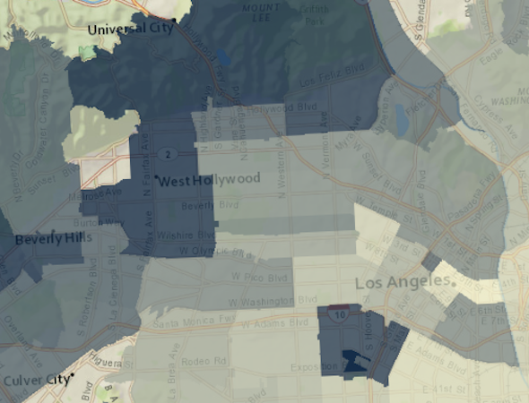

<!-- .slide: data-background="images/bg-1.png" -->

## Getting started with 3D

<br/>

### ArcGIS API for JavaScript

<br/>

<p>Javier Gutierrez</p>
<p>Jesse van den Kieboom</p>

https://github.com/jkieboom/devsummit-palm-springs-2018

---

<!-- .slide: data-background="./images/bg-8 .png" -->

# API concepts

---

## Working with the [`SceneView`](https://developers.arcgis.com/javascript/latest/api-reference/esri-views-SceneView.html)

Start with a 2D map/view, replace **[`MapView`](https://developers.arcgis.com/javascript/beta/api-reference/esri-views-MapView.html)** with [`SceneView`](https://developers.arcgis.com/javascript/beta/api-reference/esri-views-SceneView.html)

<div class="two-columns">
  <div class="left-column">

<div class="code-snippet">
<pre><code class="lang-js">view = new MapView({
  container: "viewDiv",

  map: new Map({
    basemap: "streets",

    layers: [new TileLayer(
      "...New_York_Housing_Density/MapServer"
    )]
  })
});
</code></pre>
</div>

<div class="code-snippet">
<button class="play" id="scene-view-map-view-button01"></button>
<pre><code class="lang-js">view = new SceneView({
  container: "viewDiv",

  map: new Map({
    basemap: "streets",

    layers: [new TileLayer(
      "...New_York_Housing_Density/MapServer"
    )]
  })
});
</code></pre>
</div>


  </div>
  <div class="right-column">
    <iframe id="scene-view-map-view" data-src="./examples/scene-view-map-view.html" ></iframe>
  </div>
</div>

---

## Working with the [`SceneView`](https://developers.arcgis.com/javascript/latest/api-reference/esri-views-SceneView.html)

- Unified 2D and 3D data model (the [`Map`](https://developers.arcgis.com/javascript/beta/api-reference/esri-Map.html)), [`Layer`](https://developers.arcgis.com/javascript/beta/api-reference/esri-layers-Layer.html), [`Renderer`](https://developers.arcgis.com/javascript/beta/api-reference/esri-renderers-Renderer.html) and [`Symbol`](https://developers.arcgis.com/javascript/beta/api-reference/esri-symbols-Symbol.html)
- Common [`View`](https://developers.arcgis.com/javascript/beta/api-reference/esri-views-View.html) subclass between 2D and 3D
- Makes it easy (boring!) to transition to 3D
- However, to exploit 3D, you need to learn certain 3D concepts

---

## Working with the [`SceneView`](https://developers.arcgis.com/javascript/latest/api-reference/esri-views-SceneView.html)

```ts
class SceneView {
  // Camera specifies the view
  camera: Camera;

  // Animations, framing
  goTo(...);

  // Finding graphics at screen locations
  hitTest(...);

  // Converting coordinate systems
  toScreen(mapPoint: Point): ScreenPoint;
  toMap(screenPoint: ScreenPoint): Point;
}
```

---

## [`Camera`](https://developers.arcgis.com/javascript/latest/api-reference/esri-Camera.html)

- Primary specification of the view is the [`Camera`](https://developers.arcgis.com/javascript/beta/api-reference/esri-Camera.html)

```ts
class Camera {
  // The position of the camera eye in 3D space (x, y + z elevation)
  position: Point;

  // The heading angle (towards north in degrees, [0, 360]°)
  heading: number;

  // The tilt angle ([0, 180]°, with 0° straight down, 90° horizontal)
  tilt: number;
}
```

---

## [`Camera`](https://developers.arcgis.com/javascript/latest/api-reference/esri-Camera.html)

<div class="two-columns">
  <div class="left-column">

<div class="code-snippet">
<button class="play" id="scene-view-camera-button01"></button>
<pre><code class="lang-ts">const camera = view.camera.clone();

// Increment the heading of the camera by 5 degrees
camera.heading += 5;

// Set the modified camera on the view
view.camera = camera;</code></pre>
</div>


  </div>
  <div class="right-column">
    <iframe id="camera-demo" data-src="./examples/camera-demo.html" ></iframe>
  </div>
</div>

---

## goTo

<div class="two-columns">
  <div class="left-column">

<div class="code-snippet">
<button class="play" id="scene-view-go-to-button01"></button>
<pre><code class="lang-ts">const h = view.camera.heading;

// Set the heading of the view to
// the closest multiple of 30 degrees
const heading = Math.floor(h / 30) * 30 + 30;

// go to heading preserves view.center
view.goTo({
  heading: heading
});</code></pre>
</div>

<div class="code-snippet">
<button class="play" id="scene-view-go-to-button02"></button>
<pre><code class="lang-ts">const h = view.camera.heading;

// Set the heading of the view to
// the closest multiple of 120 degrees
const heading = Math.floor(h / 120) * 120 + 120;

const target = {
  heading: heading
};

const options = {
  easing: "out-cubic",
  speedFactor: 0.2
};

view.goTo(target, options);</code></pre>
</div>

  </div>
  <div class="right-column">
    <iframe id="go-to-demo" data-src="./examples/go-to-demo.html" ></iframe>
  </div>
</div>

---

## toMap, toScreen and hitTest

<div class="two-columns">
  <div class="left-column">

<div class="code-snippet small">
<button class="play" id="scene-view-to-map-to-screen-button01"></button>
<pre><code class="lang-js">view = new SceneView({
  map: new Map({
    basemap: "satellite"
  })
});

for (var x = 1; x <= 2; x++) {
  for (var y = 1; y <= 2; y++) {
    var px = x &lowast; (view.width / 3);
    var py = y &lowast; (view.height / 3);

    view.graphics.add(new Graphic({
      geometry: view.toMap(px, py),
      symbol: symbol,
      attributes: { x: x, y: y }
    }));
  }
}</code></pre>
</div>

<div class="code-snippet small">
<pre><code class="lang-js">view.on("pointer-move", event => {
  view.hitTest({ x: event.x, y: event.y })
    .then(result => {
      var graphic = result.results[0] &&
          result.results[0].graphic;

      var attrs = graphic && graphic.attributes;

      if (attrs) {
        logDiv.textContent = \`${attrs.x}/${attrs.y}\`;
      }
    });
});</code></pre>
</div>

  </div>
  <div class="right-column">
    <iframe id="to-map-to-screen-demo" data-src="./examples/to-map-to-screen-demo.html" ></iframe>
  </div>
</div>

---

## Map

- A Map can be used with both `MapView` and `SceneView`
- `Basemap` is exactly the same concept as in 2D
- `Ground`: defines the ground surface of the scene
  - Elevation layers
  - Default world elevation layer (`"world-elevation"`)
  - Surface properties (coming later)

---

## Layers

| Layer type   | Characteristics |
|--------------|-----------------|
| `FeatureLayer` | vector |
| `CSVLayer` | vector |
| `StreamLayer` | vector |
| `MapImageLayer` | dynamic |
| `ImageryLayer` | dynamic |
| `WMSLayer` | dynamic |
| `OpenStreetMapLayer` | raster, cached |
| `TileLayer` | raster, cached |
| `WebTileLayer` | raster, cached |
| `WMTSLayer` | raster, cached |
| `VectorTileLayer` | vector, cached |

---

## Layers 3D &mdash; `elevationInfo`

- `relative-to-scene` (new)
- `relative-to-ground`, `absolute-height`, `on-the-ground`

<div class="two-columns">
  <div class="left-column">

  <div class="code-snippet small">
<pre><code class="lang-js">layer1.elevationInfo = {
  mode: "on-the-ground"
};

layer2.elevationInfo = {
  mode: "relative-to-ground",
  offset: 3000
};

layer3.elevationInfo = {
  mode: "absolute-height",
  offset: 3000
};</code></pre>
</div>

  </div>
  <div class="right-column">
    <iframe id="to-map-to-screen-demo" data-src="./examples/feature-layers-elevation-mode.html" ></iframe>
  </div>
</div>

---

## Layers 3D

| Layer type   | Characteristics |
|--------------|-----------------|
| `ElevationLayer` | raster, cached |
| `SceneLayer` | vector |
| `IntegratedMeshLayer` | vector |
| `PointCloudLayer` | vector |

---

## Layers 3D &mdash; `ElevationLayer`

- Elevation services
  - Tiled image service
  - LERC format (Limited Error Raster Compression)
- Added to `map.ground.layers`
 - Multiple elevation layers overlay just as map layers do
- `async queryElevation(geometry)`
- `async createElevationSampler(extent)`

---

## Layers 3D &mdash; `ElevationLayer`

<div class="two-columns">
  <div class="left-column">

<div class="code-snippet small">
<pre><code class="lang-js">var map = new Map({
  basemap: "satellite",
  ground: "world-elevation" // use default world elevation layer
});

// load an additional elevation layer depicting the
// elevation difference after the 2014 Oso landslide
var elevationLayer = new ElevationLayer({
  url: ".../OsoLandslide_After_3DTerrain/ImageServer",
  visible: false
});

map.ground.layers.add(elevationLayer);

var view = new SceneView(...);
</code></pre>
</div>

<div class="code-snippet small">
<button class="play" id="elevation-layers-button01"></button>
<pre><code class="lang-js">// toggle the elevation layer visiblity
elevationLayer.visible = !elevationLayer.visible
</code></pre>
</div>

<div class="code-snippet small">
<pre><code class="lang-js">// query elevation at the clicked map point
view.on("click", function(event) {
  var position = event.mapPoint;
  var query = elevationLayer.queryElevation(position);
  query.then((result) => {
    console.log(result.geometry.z)
  });
});
</code></pre>
</div>
<div class="code-output">
  <pre id="elevation-layer-output01"></pre>
</div>

  </div>
  <div class="right-column">
    <iframe id="elevation-layers" data-src="./examples/elevation-layers.html" ></iframe>
  </div>
</div>

---

## Layers &mdash; `SceneLayer` (points)

<div class="two-columns">
  <div class="left-column">

<div class="code-snippet">
<pre><code class="lang-js">// all the typical initialization
var map = new Map(...);
var view = new SceneView(...);

// Create SceneLayer and add to the map
var sceneLayer = new SceneLayer({
   url: ".../Airports_PointSceneLayer/SceneServer"
});

map.add(sceneLayer);
</code></pre>
</div>

  </div>
  <div class="right-column">
    <iframe id="scene-layer-points" data-src="./examples/scene-layer-points.html" ></iframe>
  </div>
</div>

---

## Layers &mdash; `SceneLayer` (3d object)

<div class="two-columns">
  <div class="left-column">

<div class="code-snippet">
<pre><code class="lang-js">// all the typical initialization
var map = new Map(...);
var view = new SceneView(...);

// Create SceneLayer and add to the map
var sceneLayer = new SceneLayer({
  url: ".../NYCatt/SceneServer",
});

map.add(sceneLayer);
</code></pre>
</div>

  </div>
  <div class="right-column">
    <iframe id="scene-layer-mesh" data-src="./examples/scene-layer-mesh.html" ></iframe>
  </div>
</div>

---

## Layers &mdash; `SceneLayer` (3d object)

<div class="two-columns">
  <div class="left-column">

<div class="code-snippet">
<pre><code class="lang-js">// all the typical initialization
var map = new Map(...);
var view = new SceneView(...);

// Create SceneLayer and add to the map
var sceneLayer = new SceneLayer({
  url: ".../NYCatt/SceneServer",
});

map.add(sceneLayer);
</code></pre>
</div>

<div class="code-snippet">
<button class="play" id="mesh-filtering-button01"></button>
<pre><code class="lang-js">// only show buildings constructed before 1900
sceneLayer.definitionExpression =
  "CNSTRCT_YR < 1900 AND CNSTRCT_YR > 0";
</code></pre>
</div>

<div class="code-snippet">
<button class="play" id="mesh-filtering-button03"></button>
<pre><code class="lang-js">// reset filter
sceneLayer.definitionExpression = null;
</code></pre>
</div>

<div class="code-snippet">
<button class="play" id="mesh-filtering-button02"></button>
<pre><code class="lang-js">// filter out tall buildings
sceneLayer.definitionExpression =
  "HEIGHTROOF < 100 AND HEIGHTROOF > 0";
</code></pre>
</div>

  </div>
  <div class="right-column">
    <iframe id="scene-layer-mesh2" data-src="./examples/scene-layer-mesh.html" ></iframe>
  </div>
</div>

---

## Layers &mdash; `IntegratedMeshLayer`

<div class="two-columns">
  <div class="left-column">

<div class="code-snippet">
<pre><code class="lang-js">// create the integrated mesh layer
var layer = new IntegratedMeshLayer({
  url: ".../Oxford_Scene/SceneServer"
});

// create a map with the layer added
var map = new Map({
  basemap: "streets",
  layers: [layer],
  ground: "world-elevation"
});

// finally, create a view with a good
// perspective on the integrated mesh
var view = new SceneView({
  container: "viewDiv",
  map: map,
  camera: {
    position: [-1.2567, 51.7517, 123.6058],
    heading: 41.4698,
    tilt: 75.9609
  }
});
</code></pre>
</div>

  </div>
  <div class="right-column">
    <iframe id="integrated-mesh" data-src="./examples/integrated-mesh.html" ></iframe>
  </div>
</div>

---

## Layers &mdash; `PointCloudLayer`

<div class="two-columns">
  <div class="left-column">

<div class="code-snippet">
<pre><code class="lang-js">// all the typical initialization
var map = new Map(...);
var view = new SceneView(...);

// create Point Cloud Layer
var pcLayer = new PointCloudLayer({
  url: ".../BARNEGAT_BAY_LiDAR_UTM/SceneServer"
});

map.add(pcLayer);
</code></pre>
</div>

<div class="code-snippet">
<pre><code class="lang-js">// update the render settings
function updateRenderer(pointSize, density) {
  pcLayer.renderer = new PointCloudRGBRenderer({
    field: "RGB",
    pointSizeAlgorithm: {
      type: "fixed-size",
      useRealWorldSymbolSizes: false,
      size: pSize
    },
    pointsPerInch: density
  })
}
</code></pre>
</div>

  </div>
  <div class="right-column">
    <iframe id="pointcloud-size-and-density" data-src="./examples/pointcloud-size-and-density.html" ></iframe>
  </div>
</div>

---

## Symbology

<!-- (flat) IconSymbol3DLayer - LineSymbol3DLayer - FillSymbol3DLayer -->

<table class="symbology">
  <tr>
    <th>point</th>
    <th>line</th>
    <th>polygon</th>
  </tr>
  <tr>
    <td>
      <div class="image-title">IconSymbol3DLayer</div>
      
    </td>
    <td>
      <div class="image-title">LineSymbol3DLayer</div>
      
    </td>
    <td>
      <div class="image-title dark">FillSymbol3DLayer</div>
      
    </td>
  </tr>
  <tr>
    <!-- (volumetric) ObjectSymbol3DLayer - PathSymbol3DLayer - ExtrudeSymbol3DLayer -->
    <td>
      <div class="image-title">ObjectSymbol3DLayer</div>
      
    </td>
    <td>
      <div class="image-title">PathSymbol3DLayer</div>
      
    </td>
    <td>
      <div class="image-title">ExtrudeSymbol3DLayer</div>
      
    </td>
  </tr>
</table>

---

## Symbology &mdash; `Renderer` example

- [Visual variables and SceneLayer sample](https://developers.arcgis.com/javascript/latest/sample-code/sandbox/index.html?sample=layers-scenelayer-vv-color)

---

## Symbology &mdash; `WebStyleSymbol`


```ts
const webStyleSymbol = new WebStyleSymbol({
  name: "Traffic_Barrier_1",
  styleName: "EsriRealisticStreetSceneStyle"
});
```

[Example in symbol playground](https://developers.arcgis.com/javascript/latest/sample-code/playground/live/index.html#/config=symbols/3d/WebStyleSymbol.json)

---

<!-- .slide: data-background="./images/bg-8 .png" -->

# WebScene

---

## WebScene

- Defines the content and style of a 3D Scene
- Serialized as JSON and stored in Portal/Online

---

## WebScene &mdash; Spec

- JSON spec similar to WebMap
- Layers, basemap, slides, initial state (position and light)
- Metadata: scene type, spatial reference, version...
- https://developers.arcgis.com/web-scene-specification/

---

## WebScene &mdash; API

- Supported by [`SceneView`](https://developers.arcgis.com/javascript/latest/api-reference/esri-views-SceneView.html)
- Loadable from [`Portal`](https://developers.arcgis.com/javascript/latest/api-reference/esri-portal-Portal.html)


```ts
class WebScene extends Map {
  presentation: {
    slides: Collection<Slide>;
  };

  initialViewProperties: {
    viewpoint: Viewpoint;
    environment: Environment;
    spatialReference: SpatialReference;
    viewingMode: "global" | "local";
  };

  portalItem: PortalItem;

  clippingArea: Extent;
  clippingEnabled: boolean;
}
```

---

## WebScene &mdash; `viewingMode`


|Global|Local|
|-|-|
| geographic, global extent, spherical| projected, local extent, planar, clipping|
|<a href="https://developers.arcgis.com/javascript/latest/sample-code/sandbox/index.html?sample=visualization-multivariate-3d" target="_blank"></a> | <a href="https://developers.arcgis.com/javascript/latest/sample-code/sandbox/index.html?sample=scene-local" target="_blank"></a> |

---

## New 3D widgets

- Direct line measurement
- [`esri/widgets/DirectLineMeasurement3D`](https://developers.arcgis.com/javascript/latest/sample-code/widgets-directlinemeasurement-3d/live/index.html)


---

<!-- .slide: data-background="./images/bg-8 .png" -->

# Building an App


---

## Building an App: Lyon

<div class="twos">
  <div class="snippet">
  <pre><code class="lang-js hljs javascript">var renderer = new UniqueValueRenderer({
  field: "Type",
  uniqueValueInfos: [{
    value: "Museum",
    symbol: createSymbol("Museum.png", "#D13470")
  }, {
    value: "Restaurant",
    symbol: createSymbol("Restaurant.png", "#F97C5A")
  }, {
    value: "Church",
    symbol: createSymbol("Church.png", "#884614")
  }, {
    value: "Hotel",
    symbol: createSymbol("Hotel.png", "#56B2D6")
  }, {
    value: "Park",
    symbol: createSymbol("Park.png", "#40C2B4")
  }]
});

var featLayer = new FeatureLayer({
  portalItem: {
    id: "5acdabddfb1f4852932d43f51fca57eb"
  },
  renderer: renderer
});</code>
   </pre>
  <!--<svg data-play-frame="frame-auto-cast" class="play-code" viewBox="0 0 24 24"><path fill="#999" d="M12,20.14C7.59,20.14 4,16.55 4,12.14C4,7.73 7.59,4.14 12,4.14C16.41,4.14 20,7.73 20,12.14C20,16.55 16.41,20.14 12,20.14M12,2.14A10,10 0 0,0 2,12.14A10,10 0 0,0 12,22.14A10,10 0 0,0 22,12.14C22,6.61 17.5,2.14 12,2.14M10,16.64L16,12.14L10,7.64V16.64Z" /></svg>-->
  </div>
  <div class="snippet-preview">
    <iframe id="frame-auto-cast" data-src="./snippets/lyon/01-basics.html"></iframe>
  </div>
</div>

---

## Elevation mode: `relative-to-scene`

<div class="twos">
  <div class="snippet">
  <pre><code class="lang-js hljs javascript">var featLayer = new FeatureLayer({
  portalItem: {
    id: "5acdabddfb1f4852932d43f51fca57eb"
  },
  renderer: renderer,
  elevationInfo: {
    mode: "relative-to-scene"
  }
});</code>
   </pre>
  <!--<svg data-play-frame="frame-auto-cast" class="play-code" viewBox="0 0 24 24"><path fill="#999" d="M12,20.14C7.59,20.14 4,16.55 4,12.14C4,7.73 7.59,4.14 12,4.14C16.41,4.14 20,7.73 20,12.14C20,16.55 16.41,20.14 12,20.14M12,2.14A10,10 0 0,0 2,12.14A10,10 0 0,0 12,22.14A10,10 0 0,0 22,12.14C22,6.61 17.5,2.14 12,2.14M10,16.64L16,12.14L10,7.64V16.64Z" /></svg>-->
  </div>
  <div class="snippet-preview">
    <iframe id="frame-auto-cast" data-src="./snippets/lyon/02-relative.html"></iframe>
  </div>
</div>

---

## Declutter

Number of overlapping points is reduced

<div class="twos">
  <div class="snippet">
  <pre><code class="lang-js hljs javascript">var featLayer = new FeatureLayer({
  portalItem: {
    id: "5acdabddfb1f4852932d43f51fca57eb"
  },

  renderer: renderer,

  elevationInfo: {
    mode: "relative-to-scene"
  },

  featureReduction: {
    type: "selection"
  }
});</code>
   </pre>
  <!--<svg data-play-frame="frame-auto-cast" class="play-code" viewBox="0 0 24 24"><path fill="#999" d="M12,20.14C7.59,20.14 4,16.55 4,12.14C4,7.73 7.59,4.14 12,4.14C16.41,4.14 20,7.73 20,12.14C20,16.55 16.41,20.14 12,20.14M12,2.14A10,10 0 0,0 2,12.14A10,10 0 0,0 12,22.14A10,10 0 0,0 22,12.14C22,6.61 17.5,2.14 12,2.14M10,16.64L16,12.14L10,7.64V16.64Z" /></svg>-->
  </div>
  <div class="snippet-preview">
    <iframe id="frame-auto-cast" data-src="./snippets/lyon/03-declutter.html"></iframe>
  </div>
</div>

---

## Improve Perspective

Improve the sense of depth for 2D icons

<div class="twos">
  <div class="snippet">
  <pre><code class="lang-js hljs javascript">var featLayer = new FeatureLayer({
  portalItem: {
    id: "5acdabddfb1f4852932d43f51fca57eb"
  },

  renderer: renderer,

  elevationInfo: {
    mode: "relative-to-scene"
  },

  featureReduction: {
    type: "selection"
  },

  screenSizePerspectiveEnabled: true
});</code>
   </pre>
  <!--<svg data-play-frame="frame-auto-cast" class="play-code" viewBox="0 0 24 24"><path fill="#999" d="M12,20.14C7.59,20.14 4,16.55 4,12.14C4,7.73 7.59,4.14 12,4.14C16.41,4.14 20,7.73 20,12.14C20,16.55 16.41,20.14 12,20.14M12,2.14A10,10 0 0,0 2,12.14A10,10 0 0,0 12,22.14A10,10 0 0,0 22,12.14C22,6.61 17.5,2.14 12,2.14M10,16.64L16,12.14L10,7.64V16.64Z" /></svg>-->
  </div>
  <div class="snippet-preview">
    <iframe id="frame-auto-cast" data-src="./snippets/lyon/04-perspective.html"></iframe>
  </div>
</div>

---

## Callout Lines

Lift symbols above the ground for better visibility.

<div class="twos">
  <div class="snippet">
  <pre><code class="lang-js hljs javascript">new PointSymbol3D({
  symbolLayers: ...,

  verticalOffset: {
    screenLength: 40,
    maxWorldLength: 200,
    minWorldLength: 35
  },

  callout: new LineCallout3D({
    color: "white",
    size: 2,

    border: {
      color: color
    }
  })
});</code>
   </pre>
  <!--<svg data-play-frame="frame-auto-cast" class="play-code" viewBox="0 0 24 24"><path fill="#999" d="M12,20.14C7.59,20.14 4,16.55 4,12.14C4,7.73 7.59,4.14 12,4.14C16.41,4.14 20,7.73 20,12.14C20,16.55 16.41,20.14 12,20.14M12,2.14A10,10 0 0,0 2,12.14A10,10 0 0,0 12,22.14A10,10 0 0,0 22,12.14C22,6.61 17.5,2.14 12,2.14M10,16.64L16,12.14L10,7.64V16.64Z" /></svg>-->
  </div>
  <div class="snippet-preview">
    <iframe id="frame-auto-cast" data-src="./snippets/lyon/05-callout.html"></iframe>
  </div>
</div>

---

## 3D Models

Use WebStyleSymbols to include 3d models in your scene

<div class="twos">
  <div class="snippet">
  <pre><code class="lang-js hljs javascript">new UniqueValueRenderer({
  field: "TYPE",
  uniqueValueInfos: [
    {
      value: "taxi",

      symbol: new WebStyleSymbol({
        name: "Taxi",
        styleName: "EsriRealisticTransportationStyle"
      })
    }
  // ...
  ]
});</code>
   </pre>
  <!--<svg data-play-frame="frame-auto-cast" class="play-code" viewBox="0 0 24 24"><path fill="#999" d="M12,20.14C7.59,20.14 4,16.55 4,12.14C4,7.73 7.59,4.14 12,4.14C16.41,4.14 20,7.73 20,12.14C20,16.55 16.41,20.14 12,20.14M12,2.14A10,10 0 0,0 2,12.14A10,10 0 0,0 12,22.14A10,10 0 0,0 22,12.14C22,6.61 17.5,2.14 12,2.14M10,16.64L16,12.14L10,7.64V16.64Z" /></svg>-->
  </div>
  <div class="snippet-preview">
    <iframe id="frame-auto-cast" data-src="./snippets/lyon/06-models.html"></iframe>
  </div>
</div>

---

## Webscene loading

Loading a webscene by id

<div class="twos">
  <div class="snippet">
  <pre><code class="lang-js hljs javascript">var map = new WebScene({
  portalItem: {
    id: "8b464fd68d87480486d36e8cbbc52ab9"
  }
});

var view = new SceneView({
  container: "viewDiv",
  map: map
});</code>
   </pre>
  <!--<svg data-play-frame="frame-auto-cast" class="play-code" viewBox="0 0 24 24"><path fill="#999" d="M12,20.14C7.59,20.14 4,16.55 4,12.14C4,7.73 7.59,4.14 12,4.14C16.41,4.14 20,7.73 20,12.14C20,16.55 16.41,20.14 12,20.14M12,2.14A10,10 0 0,0 2,12.14A10,10 0 0,0 12,22.14A10,10 0 0,0 22,12.14C22,6.61 17.5,2.14 12,2.14M10,16.64L16,12.14L10,7.64V16.64Z" /></svg>-->
  </div>
  <div class="snippet-preview">
    <iframe id="frame-auto-cast" data-src="./snippets/lyon/07-webscene-load.html"></iframe>
  </div>
</div>

---

## Popups and webscene saving

Adding a custom popup template and saving the webscene

<div class="twos">
  <div class="snippet">
  <pre><code class="lang-js hljs javascript">featLayer.popupTemplate = new PopupTemplate({
    title: "{NAME}",
    content: "{ADDRESS}<br/>" +
    "Telephone: {TELEPHONE}<br/>" +
    "Website: {WEBSITE}<br/>"
  });
});

// ...

var portal = new Portal({
  url: myPortalUrl,
  authMode: "immediate"
});

portal.load().then(function() {
  webscene.saveAs({
    title: "My Scene",
    portal: portal
  });
});</code>
   </pre>
  <!--<svg data-play-frame="frame-auto-cast" class="play-code" viewBox="0 0 24 24"><path fill="#999" d="M12,20.14C7.59,20.14 4,16.55 4,12.14C4,7.73 7.59,4.14 12,4.14C16.41,4.14 20,7.73 20,12.14C20,16.55 16.41,20.14 12,20.14M12,2.14A10,10 0 0,0 2,12.14A10,10 0 0,0 12,22.14A10,10 0 0,0 22,12.14C22,6.61 17.5,2.14 12,2.14M10,16.64L16,12.14L10,7.64V16.64Z" /></svg>-->
  </div>
  <div class="snippet-preview">
    <iframe id="frame-auto-cast" data-src="./snippets/lyon/08-popup.html"></iframe>
  </div>
</div>

---

<!-- .slide: data-background="./images/bg-final.jpg" -->


